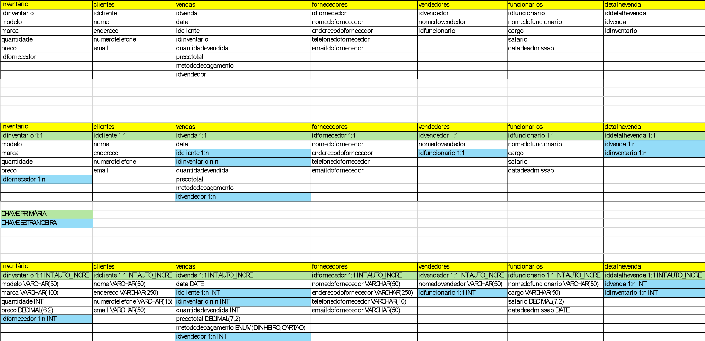
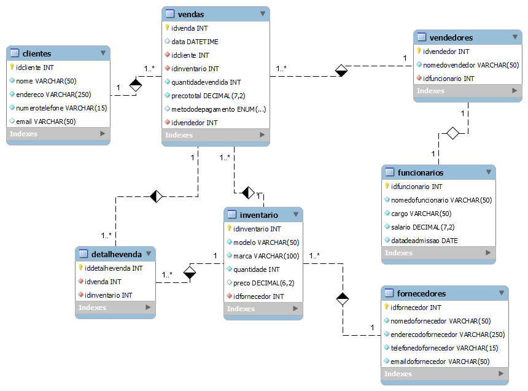

# Estudo de caso Bike Shop

## Desenvolvimento das modelagens do estudo de caso

### O estudo de caso:


Empresa: BikeShop
Visão Geral:
A BikeShop é uma empresa especializada na venda de bicicletas e acessórios relacionados. 
Localizada em uma área urbana movimentada de Uberlândia, Minas Gerais, a empresa tem 
como objetivo oferecer uma variedade de bicicletas de alta qualidade para ciclistas de todos os 
níveis, desde iniciantes até ciclistas experientes e entusiastas.

Desafio:
A BikeShop está crescendo rapidamente e enfrenta desafios no gerenciamento eficiente de seu 
inventário, clientes e vendas. Atualmente, eles estão registrando essas informações 
manualmente ou usando planilhas eletrônicas, o que se tornou ineficiente e propenso a erros. 
Eles reconhecem a necessidade de um sistema de banco de dados centralizado que possa 
armazenar e gerenciar essas informações de forma mais eficaz.

Objetivos do Sistema de Banco de Dados:
Gerenciar o inventário de bicicletas e acessórios, incluindo detalhes como modelo, marca, 
quantidade em estoque, preço de venda e fornecedor.
Manter um registro centralizado de clientes, incluindo informações como nome, endereço, 
número de telefone, endereço de e-mail e histórico de compras.
Registrar e acompanhar as vendas de bicicletas e acessórios, incluindo detalhes como data da 
venda, produtos vendidos, preço de venda, método de pagamento e vendedor responsável.

Requisitos Funcionais do Sistema de Banco de Dados:
Capacidade de adicionar, atualizar e excluir itens do inventário, bem como verificar a 
disponibilidade de produtos em tempo real.
Capacidade de adicionar novos clientes, atualizar informações existentes e manter um histórico 
de suas compras anteriores.
Funcionalidade para registrar novas vendas, incluindo a associação dos produtos vendidos aos 
clientes correspondentes e a geração de recibos.
Recursos de segurança para proteger os dados do cliente e do inventário contra acesso não 
autorizado.
Capacidade de gerar relatórios de vendas, análises de estoque e dados do cliente para ajudar 
na tomada de decisões comerciais.

Abordagem Proposta:
A BikeShop planeja desenvolver um sistema de banco de dados personalizado usando 
tecnologias modernas de banco de dados, como MySQL ou PostgreSQL. Eles planejam 
colaborar com desenvolvedores de software especializados para projetar e implementar o 
sistema de acordo com seus requisitos específicos. O sistema será acessado por funcionários 
autorizados por meio de uma interface de usuário intuitiva, onde poderão realizar todas as 
operações necessárias de forma eficiente.

Benefícios Esperados:
Melhoria na eficiência operacional, permitindo que a BikeShop gerencie seu inventário, clientes 
e vendas de forma mais rápida e precisa.
Maior satisfação do cliente, oferecendo um serviço mais personalizado e mantendo um 
histórico detalhado das interações anteriores.
Melhoria na tomada de decisões comerciais com base em relatórios e análises de dados 
precisos e atualizados.
Com um sistema de banco de dados eficiente e bem projetado, a BikeShop está confiante de 
que poderá atender às demandas de seus clientes de maneira mais eficaz e continuar 
prosperando no mercado de bicicletas.

### Esquema de tabela para o banco de dados


#### Modelo Físico: código que gera o banco de dados
```sql
CREATE DATABASE bikeshop;

USE bikeshop;

CREATE TABLE inventario(
idinventario INT AUTO_INCREMENT PRIMARY KEY,
modelo VARCHAR(50) not null,
marca varchar(100) not null,
quantidade INT not null,
preco DECIMAL(6,2),
idfornecedor INT not null
);

CREATE TABLE clientes(
idcliente int auto_increment primary key,
nome varchar(50) not null,
endereco varchar(250) not null,
numerotelefone varchar(15) not null,
email varchar(50)
);

CREATE TABLE vendas(
idvenda int auto_increment primary key,
data DATETIME default current_timestamp(),
idcliente int not null,
idinventario int not null,
quantidadevendida int not null,
precototal decimal(7,2) not null,
metododepagamento ENUM("Dinheiro","Crédito","Débito","Pix"),
idvendedor int not null
);

CREATE TABLE fornecedores(
idfornecedor int auto_increment primary key,
nomedofornecedor varchar(50) not null,
enderecodofornecedor varchar(250) not null,
telefonedofornecedor varchar(15) not null,
emaildofornecedor varchar(50) not null
);

CREATE TABLE vendedores(
idvendedor int auto_increment primary key,
nomedovendedor varchar(50) not null,
idfuncionario int not null
);

CREATE TABLE funcionarios(
idfuncionario int auto_increment primary key,
nomedofuncionario varchar(50) not null,
cargo varchar(50) not null,
salario decimal(7,2) not null,
datadeadmissao DATE not null
);

CREATE TABLE detalhevenda(
iddetalhevenda int auto_increment primary key,
idvenda int not null,
idinventario int not null
);

ALTER TABLE inventario ADD CONSTRAINT `fk.inventario_pk.fornec` foreign key inventario(`idfornecedor`) references fornecedores(`idfornecedor`);

ALTER TABLE vendas add constraint `fk.vendas_pk.clientes` foreign key vendas(`idcliente`) references clientes(`idcliente`);
ALTER TABLE vendas add constraint `fk.vendas_pk.inventario` foreign key vendas(`idinventario`) references inventario(`idinventario`);
ALTER TABLE vendas add constraint `fk.vendas_pk.vendedor` foreign key vendas(`idvendedor`) references vendedores(`idvendedor`);

ALTER TABLE vendedores add constraint `fk.vendedores_pk.funcionarios` foreign key vendedores(`idfuncionario`) references funcionarios(`idfuncionario`);

ALTER TABLE detalhevenda add constraint `fk.detalhevenda_pk.venda` foreign key detalhevenda(`idvenda`) references vendas(`idvenda`);
ALTER TABLE detalhevenda add constraint `fk.detalhevenda_pk.inventario` foreign key detalhevenda(`idinventario`) references inventario(`idinventario`);
```

### Modelo Relacional do Bando de Dados
